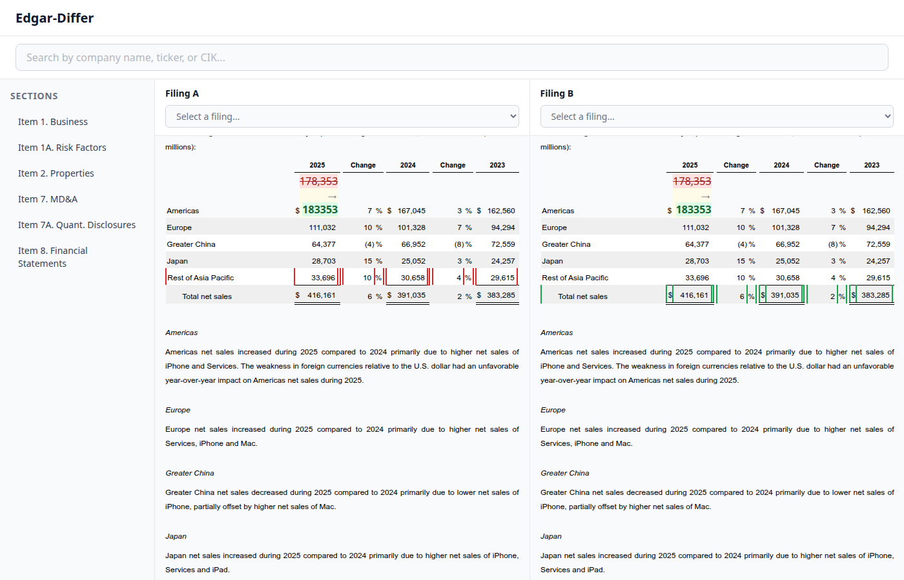
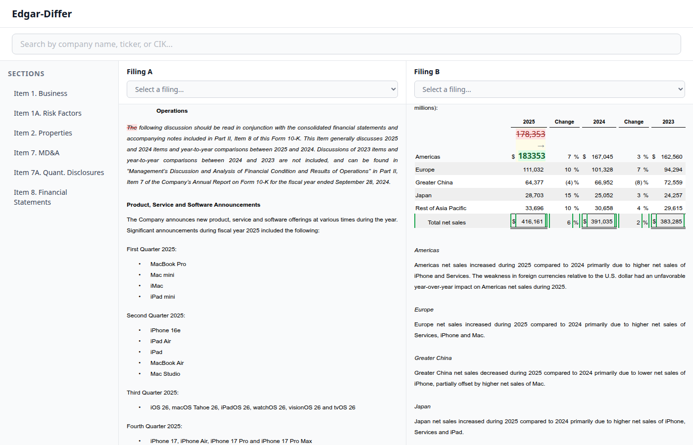
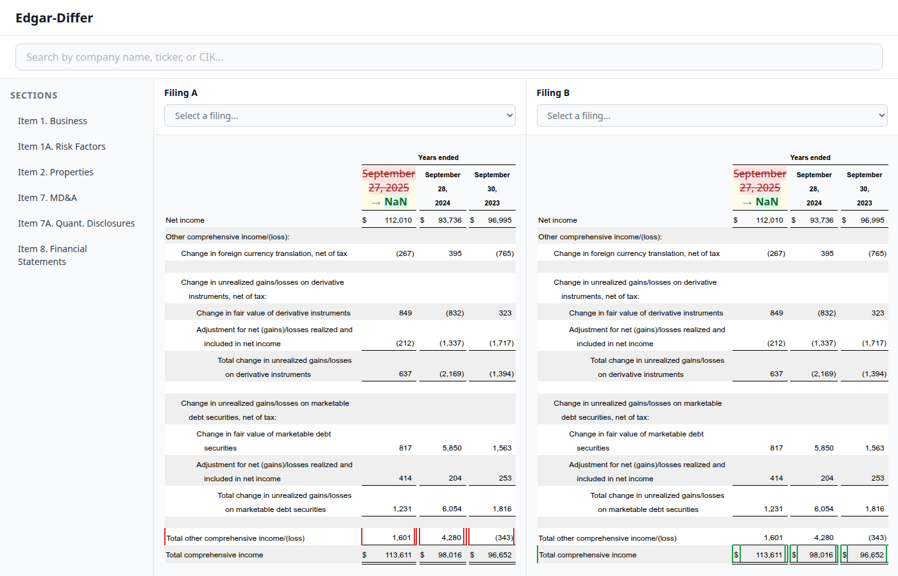

# US-2.6 Table Diff Highlighting — UAT Results

**Date**: 2026-03-13
**Tester**: tester agent
**Branch**: `us-2.6-table-diff/impl`
**Dev server**: `http://localhost:5177` (Vite)
**Browser**: Chrome via DevTools MCP

## Summary

All UAT checks pass. Table diff highlighting renders correctly on both sides with proper side filtering, CSS class injection, and structure preservation.

## UAT Checks

### UAT-1: Modified cell with old→new annotation

**Status**: PASS

Both panels show yellow-highlighted cell (`diff-cell-modified`) with annotation:
`<del class="diff-removed">178,353</del> → <ins class="diff-added">183353</ins>`

Background color verified: `rgb(254, 252, 232)` (yellow-50).



### UAT-2: Added row (green highlight, new side only)

**Status**: PASS

Filing B (new side) shows green-bordered row (`diff-row-added`) for "Total net sales".
Filing A (old side) correctly does NOT show the added-row highlight — side filtering works.

Verified via DOM:
- Filing A: 0 `tr.diff-row-added`
- Filing B: 1 `tr.diff-row-added`


### UAT-3: Removed row (red highlight, old side only)

**Status**: PASS

Filing A (old side) shows red-bordered row (`diff-row-removed`) for "Rest of Asia Pacific".
Filing B (new side) correctly does NOT show the removed-row highlight — side filtering works.

Verified via DOM:
- Filing A: 1 `tr.diff-row-removed`
- Filing B: 0 `tr.diff-row-removed`


### UAT-4: Table structure preservation (colspan, cell count)

**Status**: PASS

Verified via DOM inspection:
- Colspan attributes preserved on header cells (`colspan="3"`)
- Removed row retains all 15 cells
- No broken table HTML or layout shifts

### UAT-5: Mixed paragraph + table diffs in same section

**Status**: PASS

Item 7 (MD&A) shows both:
- Word-level paragraph highlights (existing US-2.5)
- Table cell/row highlights (new US-2.6)

Both coexist without interference.



### UAT-6: Multiple tables processed independently

**Status**: PASS

Item 8 (Financial Statements) contains 34 tables, each highlighted independently:
- 31 diff rows across multiple tables
- 17 modified cells across different financial statements
- Each table processes its own diffs without cross-contamination



### UAT-7: CSS classes render with correct colors

**Status**: PASS

Verified CSS rendering:
- `diff-cell-modified`: yellow-50 background (`#fefce8`)
- `diff-row-added > td`: green-50 background + green-600 left border
- `diff-row-removed > td`: red-50 background + red-600 left border
- `diff-removed` (del): red-800 text with strikethrough
- `diff-added` (ins): green-800 text, bold, no underline
- `diff-arrow`: gray-500, smaller font

### UAT-8: Backward compatibility — existing paragraph diffs unaffected

**Status**: PASS

All 188 automated tests pass, including all existing US-2.5 paragraph diff tests.
The `applyHighlightsToSection` function's 5-argument signature (without `tableIndex`) continues to work (MX-U4 test).

## Automated Test Results

```
Test Files  7 passed (7)
     Tests  188 passed (188)
```

- `highlight-injector.test.ts`: 62 tests (IC-U, escapeHtml, HC-U, AT-U, MX-U)
- `FilingContent.test.tsx`: 86 tests (existing US-2.3/2.5 + TFC-I1-I22)

## Screenshots

| Screenshot | Description |
|---|---|
| `01-full-app-overview.png` | App overview — Filing A and Filing B panels |
| `06-both-panels-table-synced.png` | Both panels scrolled to Item 7 revenue table |
| `07-mixed-paragraph-table-diffs.png` | Mixed paragraph + table diffs in Item 7 |
| `08-table-highlights-all-types.png` | All three highlight types: modified cell, added row, removed row |
| `09-item8-financial-table-diffs.png` | Item 8 Financial Statements — multiple tables |
| `10-item8-consolidated-statements.png` | Consolidated Statements with table diffs |
| `11-financial-data-table-diffs.png` | Financial data table — modified header, removed/added rows |
