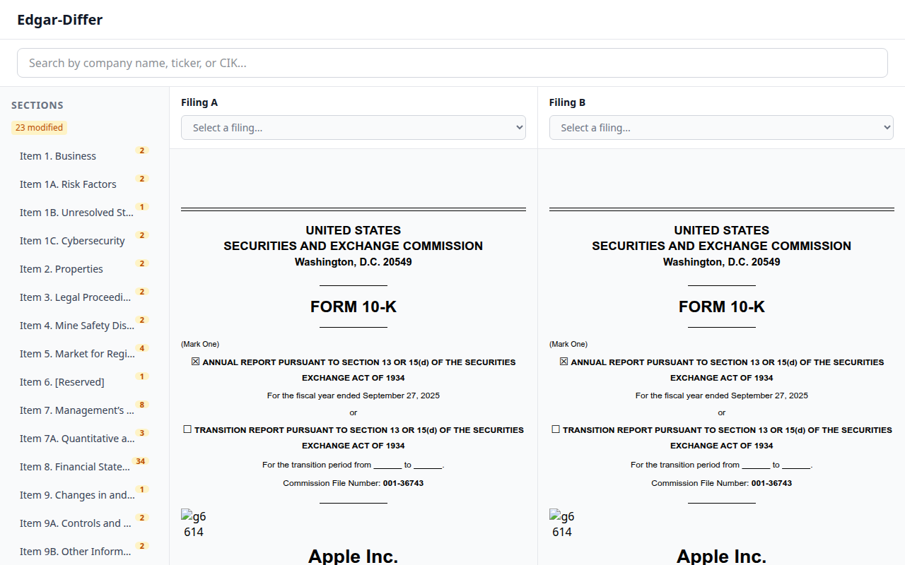
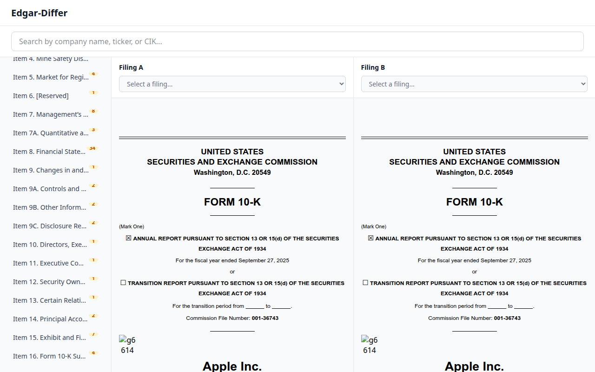
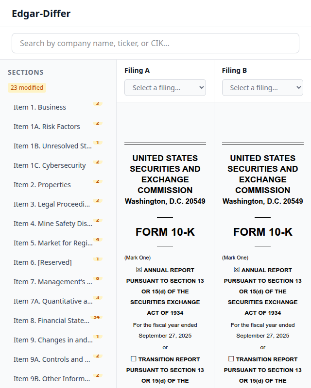

# US-2.7: Section Change Badges — UAT Results

**Date:** 2026-03-14 (re-run after badge readability fix)
**Viewport:** 1280x800 (default), 640x800 (narrow)
**Browser:** Chrome via DevTools MCP
**Result:** ALL CHECKS PASS

---

## 1. Diff Summary Bar

**Action:** Navigate to `http://localhost:5173`, inspect the section nav sidebar.

**Verify:**
- Summary bar appears below "SECTIONS" heading and above section list
- Shows "23 modified" in amber (`text-amber-700 bg-amber-100`)
- Has `role="status"` and `aria-label="Diff summary"`
- Zero-count categories (added, removed, unchanged) are omitted

**Result:** PASS

---

## 2. Change Count Badges — Readability

**Action:** Inspect each section nav button.

**Verify:**
- Badges are absolutely positioned at the top-right of each heading
- Badge numbers are **clearly legible** (`text-[11px] font-semibold px-1.5`)
- Compact number-only pills with `rounded-full`
- Each modified section shows an amber badge with the change count number
- Badge has amber styling (`text-amber-700 bg-amber-100`)
- Badge `aria-label` provides full context (e.g., "2 changes")

**Observed values:**
| Section | Visible Badge | aria-label |
|---------|:---:|------------|
| Item 1. Business | 2 | 2 changes |
| Item 1A. Risk Factors | 2 | 2 changes |
| Item 1B. Unresolved Staff Comments | 1 | 1 change |
| Item 1C. Cybersecurity | 2 | 2 changes |
| Item 2. Properties | 2 | 2 changes |
| Item 3. Legal Proceedings | 2 | 2 changes |
| Item 4. Mine Safety Disclosures | 2 | 2 changes |
| Item 5. Market for Registrant's... | 4 | 4 changes |
| Item 6. [Reserved] | 1 | 1 change |
| Item 7. Management's Discussion... | 8 | 8 changes |
| Item 7A. Quantitative... | 3 | 3 changes |
| Item 8. Financial Statements... | 34 | 34 changes |
| Item 9. Changes in... | 1 | 1 change |
| Item 9A. Controls and Procedures | 2 | 2 changes |
| Item 9B. Other Information | 2 | 2 changes |
| Item 9C. Disclosure Regarding... | 2 | 2 changes |
| Item 10. Directors... | 1 | 1 change |
| Item 11. Executive Compensation | 1 | 1 change |
| Item 12. Security Ownership... | 1 | 1 change |
| Item 13. Certain Relationships... | 1 | 1 change |
| Item 14. Principal Accountant... | 2 | 2 changes |
| Item 15. Exhibit and Financial... | 7 | 7 changes |
| Item 16. Form 10-K Summary | 4 | 4 changes |

**Result:** PASS

---

## 3. No Console Errors

**Action:** Check browser console for errors and warnings.

**Verify:** No errors or warnings present.

**Result:** PASS

---

## 4. Scroll Behavior — Badges Remain Visible

**Action:** Scroll the section nav to the bottom.

**Verify:**
- Badges remain visible on all sections during and after scroll
- Nav scrolls independently from filing panels

**Result:** PASS

---

## 5. Responsive — Narrow Viewport (640x800)

**Action:** Resize viewport to 640x800.

**Verify:**
- Layout doesn't break
- Section nav still visible with badges
- Badge numbers remain legible at narrow width
- No horizontal scrollbar
- Summary bar still visible
- All three columns still visible

**Result:** PASS

---

## 6. Accessibility — ARIA Attributes

**Action:** Inspect accessibility tree via snapshot.

**Verify:**
- Diff summary bar has `role="status"` and `aria-label="Diff summary"`
- Each badge has `aria-label` with full context (e.g., "2 changes", "1 change")
- Button accessible names combine heading + badge aria-label
- Navigation landmark is present with `aria-labelledby`

**Observed:** Accessibility tree confirms all ARIA attributes present and correct.

**Result:** PASS

---

## Summary

| Check | Status |
|-------|--------|
| Diff summary bar renders with correct counts | PASS |
| Badge numbers clearly legible | PASS |
| No console errors | PASS |
| Badges visible after scroll | PASS |
| Responsive at 640x800 | PASS |
| ARIA accessibility attributes | PASS |

**Overall: ALL CHECKS PASS**

---

## Notes

- All sections in the sample data are `changeType='modified'`, so green ("Added") and red ("Removed") text badges are not visible in this UAT. Those badge types are verified by unit tests (SN-U14, SN-U15, SN-U18, SN-U19, SN-U28, SN-U29).
- The diff summary bar only shows "23 modified" because all sample sections have the same changeType. Zero-count suppression is verified by unit test SN-U45.
- Badge style evolved through PR feedback: block → inline flex → superscript → absolute positioned → readability fix (`text-[11px] font-semibold px-1.5`).
