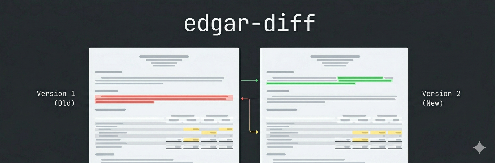

<p align="center">
  
</p>

# edgar-diff

**Compare SEC filings side-by-side. See exactly what changed.**

edgar-diff pulls full-text filings from the SEC EDGAR database and produces structured, section-by-section diffs — turning hours of manual comparison into seconds.

---

> [!NOTE]
> **This project was built entirely by AI.** Every line of code, every test, and every piece of documentation was written using AI tools (Claude) through an intentional vibe-engineering process. This was a targeted experiment in building a small, useful piece of software using AI tools exclusively — learning what works, what doesn't, and how to direct AI effectively for real engineering output. A detailed write-up of the process is forthcoming.

> [!WARNING]
> **This project is not actively maintained.** It was built as a learning experiment. You are welcome to use it, fork it, and build on it, but don't expect ongoing updates or support.

---

## What It Does

- **Side-by-side diff view** — Additions, deletions, and modifications highlighted inline, organized by filing section (Risk Factors, MD&A, Financial Statements, etc.)
- **Structured parsing** — Filings are parsed into semantic sections, not treated as raw text blobs. A renamed section won't show up as a full delete + add.
- **Direct EDGAR integration** — Pulls filings straight from SEC EDGAR. No third-party data dependency.
- **Reusable diff library** — The core engine (`@edgar-diff/lib`) is decoupled from the UI and can be embedded in pipelines, monitors, or other tools.

## Project Structure

```
edgar-diff/
├── apps/web/          # React web application (Vite + Cloudflare Workers)
├── libs/edgar-diff-lib/  # Core library: EDGAR client, filing parser, diff engine
├── scripts/           # Dev utilities (filing analysis, fetching)
└── docs/              # Setup guides and development docs
```

**Monorepo** managed with [pnpm workspaces](https://pnpm.io/workspaces) and [Nx](https://nx.dev/) for task orchestration.

## Tech Stack

- **Runtime:** Node.js >= 20
- **Package Manager:** pnpm (via corepack)
- **Build/Task Runner:** Nx
- **Language:** TypeScript
- **Web App:** React 19, Vite, Tailwind CSS, Cloudflare Workers
- **Testing:** Vitest, Testing Library, fast-check (property-based)
- **Core Lib:** htmlparser2, diff, jaro-winkler (section matching)

## Getting Started

### Prerequisites

- [Node.js](https://nodejs.org/) >= 20
- Git

### Setup

```bash
# Clone the repo
git clone https://github.com/galexy/edgar-diff.git
cd edgar-diff

# Enable corepack (provides pnpm — do NOT install pnpm globally)
corepack enable

# Install dependencies
pnpm install

# Verify everything works
pnpm nx run-many --target=typecheck
pnpm nx run-many --target=test
```

### Running the Web App

```bash
pnpm nx dev web
```

### Running Tests

```bash
# All tests (unit + integration + fixture-based e2e)
pnpm nx run-many --target=test

# Single project
pnpm nx test edgar-diff-lib

# Only affected projects (faster for incremental work)
pnpm nx affected --target=test

# Lint
pnpm nx run-many --target=lint

# Typecheck
pnpm nx run-many --target=typecheck
```

### Common Issues

| Problem | Fix |
|---|---|
| `pnpm: command not found` | Run `corepack enable` |
| pnpm version mismatch | Remove global pnpm: `npm uninstall -g pnpm && corepack enable` |
| `nx: command not found` | Use `pnpm nx ...` (Nx is a devDependency, not global) |
| `Cannot find module` after branch switch | `pnpm install && pnpm nx reset` |

See [docs/setup.md](docs/setup.md) for more detailed troubleshooting.

## License

This project is licensed under the [MIT License](LICENSE).
